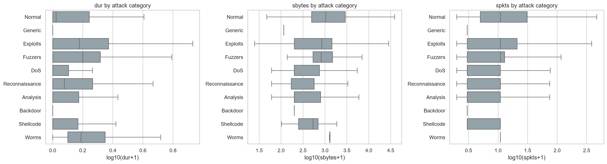
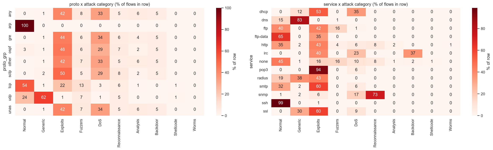
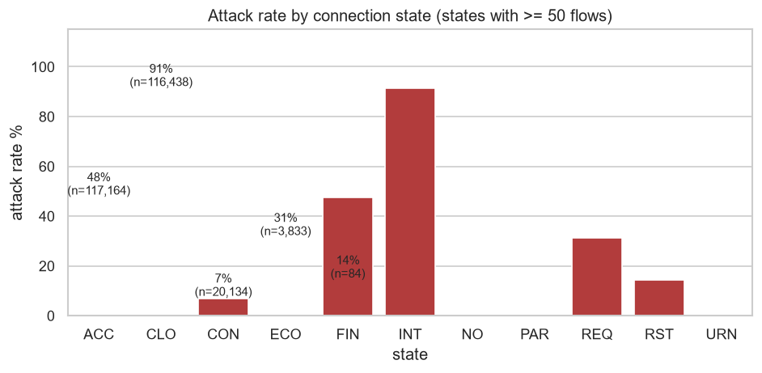
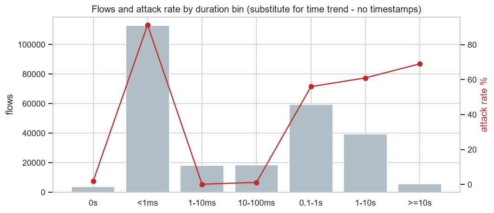
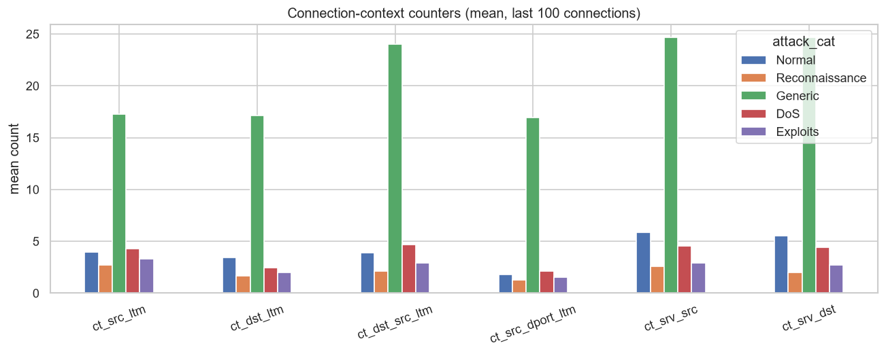
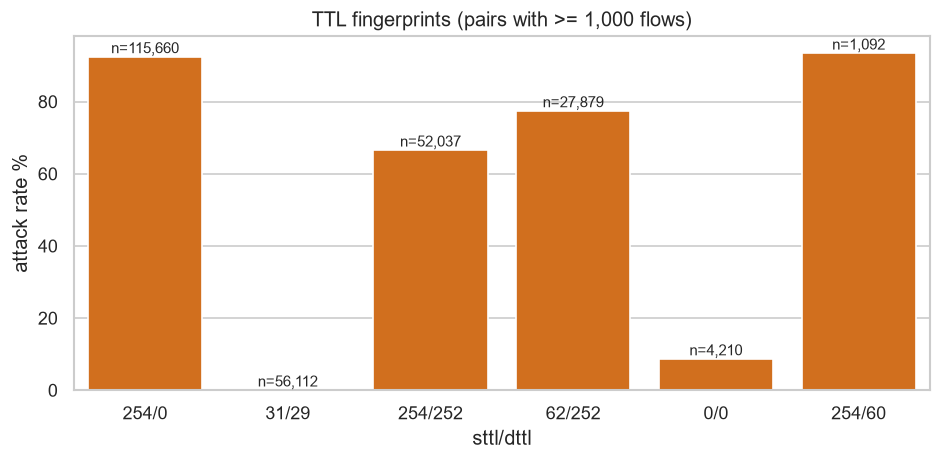
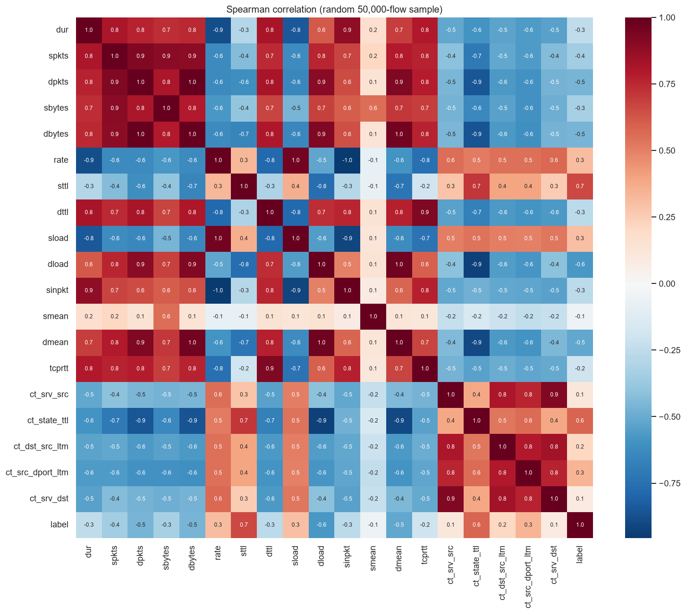

# Threat pattern analysis - findings

Generated by `src/threat_patterns.py`. Figures in `reports/figures/`.

## 05_profile_boxplots

Generic attacks are tiny and fast: median sbytes 114 B and median duration 0.000008s vs 1040 B / 0.054s for normal flows. Exploits carry the heaviest payloads among attacks (median sbytes 842 B). Volume alone does not separate attacks: several attack classes overlap heavily with normal traffic.

## 05_proto_service_heatmap

DNS is dominated by Generic attacks (83.4% of DNS flows). The 'unas' protocol is 100% malicious (15,599 flows, mostly Exploits 42%, DoS 34%, Fuzzers 7%). 'other' (rare) protocols are almost entirely attacks (99.6%), while ARP is entirely normal.

## 05_state_attack_rate

INT (interrupted/no-reply) connections have a 91.2% attack rate across 116,438 flows, versus 7.0% for CON (established, two-way) flows. Half-open / unanswered connections are the strongest single state signal.

## 05_duration_bins

No timestamps exist in this release, so hourly/daily spikes cannot be measured. As a substitute, sub-millisecond flows (112,982) are 91.3% attacks, while 1-100 ms flows are almost all normal (0.1% and 1.2%) - a burst-like, automated signature.

## 05_recon_context

Generic attacks are highly repetitive: mean ct_dst_src_ltm 24.0 vs 3.9 for normal (same host pair hammered repeatedly). Reconnaissance flows, by contrast, show LOW repetition (2.1) - consistent with probes spread across many targets. Without IPs/ports, true distinct-port scan counts cannot be computed.

## 05_ttl_fingerprint

sttl/dttl = 254/0 covers 115,660 flows with a 92.4% attack rate, while 31/29 (56,112 flows) is 0% attacks. These TTLs reflect the lab's attack-generator topology, so models will exploit them - a known UNSW-NB15 artefact that will not transfer to other networks.

## 05_correlation_heatmap

Strongest monotonic correlates of the attack label: sttl (+0.66), ct_state_ttl (+0.59), dload (-0.58), dmean (-0.51), dbytes (-0.46). Byte/packet counters are strongly inter-correlated (redundant), which matters for linear models.

## statistical_tests

Chi-square shows attack type depends strongly on protocol (chi2=232,697, dof=72, p~0 (below float precision), Cramer's V=0.34) and service (Cramer's V=0.32). Mann-Whitney U: attack flows send fewer bytes than normal flows (median sbytes 200 vs 1040, rank-biserial -0.40) and receive far fewer (dbytes r=-0.53, large). With n=257,673 every p-value is ~0, so effect sizes - not p-values - indicate practical importance.

## Mann-Whitney U (attack vs normal)

| feature   |   median_attack |   median_normal |    p_value |   rank_biserial | effect     |
|:----------|----------------:|----------------:|-----------:|----------------:|:-----------|
| sbytes    |     200         |      1040       | 0          |         -0.4045 | medium     |
| dbytes    |       0         |       642       | 0          |         -0.533  | large      |
| dur       |       9e-06     |         0.05394 | 0          |         -0.3079 | medium     |
| spkts     |       2         |        10       | 0          |         -0.4012 | medium     |
| dpkts     |       0         |         8       | 0          |         -0.5291 | large      |
| rate      |       1.111e+05 |       642.3     | 0          |          0.3762 | medium     |
| sttl      |     254         |        31       | 0          |          0.6668 | large      |
| smean     |      65         |        73       | 6.365e-234 |         -0.0768 | negligible |
